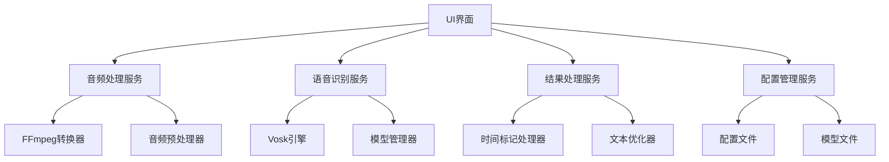
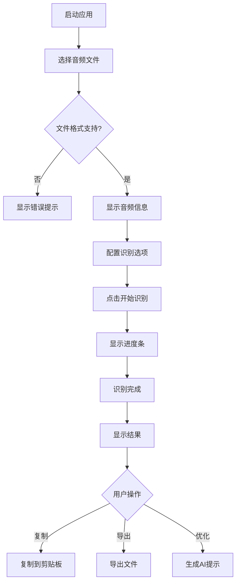
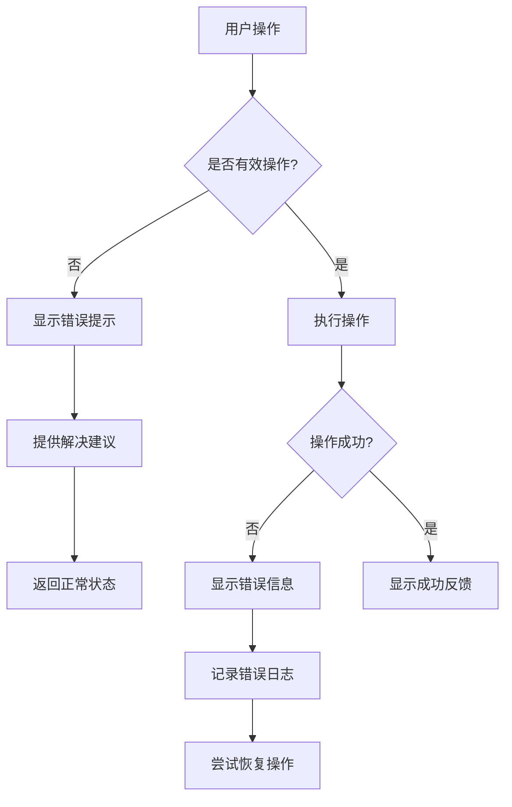

# 音频识别应用设计文档

## 1. 项目概述

### 1.1 项目简介
本项目是一个基于Go语言和Vosk语音识别引擎的跨平台桌面应用，旨在为用户提供简单易用的音频文件转录服务。应用支持多种音频格式，能够生成带有时间标记的文本结果，并提供了AI优化功能，方便用户进一步处理识别结果。

### 1.2 核心功能
- **多格式音频支持**: 支持MP3、WAV、M4A、FLAC等常见音频格式
- **实时语音识别**: 基于Vosk引擎的离线语音识别
- **时间标记生成**: 自动生成精确到毫秒的时间戳
- **智能文本优化**: 提供AI友好的优化提示词
- **跨平台运行**: 支持Windows、macOS、Linux三大平台
- **自定义模型**: 支持用户自定义语音识别模型

### 1.3 目标用户
- 需要制作字幕的视频创作者
- 需要整理录音内容的会议记录者
- 需要提取歌词的音乐爱好者
- 需要转录音频内容的文字工作者

## 2. 需求分析

### 2.1 功能性需求

#### 2.1.1 音频处理需求
| 需求ID | 需求描述 | 优先级 |
|--------|----------|--------|
| FR-001 | 支持常见音频格式导入 | 高 |
| FR-002 | 自动音频格式转换 | 高 |
| FR-003 | 音频预处理和降噪 | 中 |
| FR-004 | 支持大文件分块处理 | 高 |

#### 2.1.2 语音识别需求
| 需求ID | 需求描述 | 优先级 |
|--------|----------|--------|
| FR-005 | 多语言识别支持 | 高 |
| FR-006 | 自定义识别模型 | 中 |
| FR-007 | 实时识别进度显示 | 高 |
| FR-008 | 置信度评分 | 中 |

#### 2.1.3 结果处理需求
| 需求ID | 需求描述 | 优先级 |
|--------|----------|--------|
| FR-009 | 时间戳标记生成 | 高 |
| FR-010 | 文本结果导出 | 高 |
| FR-011 | AI优化提示生成 | 中 |
| FR-012 | 多种复制格式 | 高 |

### 2.2 非功能性需求

#### 2.2.1 性能需求
- 音频处理速度: 实时处理速度不低于音频播放速度的1.5倍
- 内存使用: 处理100MB音频文件时内存占用不超过512MB
- 启动时间: 应用启动时间不超过5秒

#### 2.2.2 可用性需求
- 界面响应时间: 用户操作响应时间不超过200ms
- 操作简便性: 新用户无需阅读文档即可完成基本操作
- 错误处理: 提供清晰的错误提示和解决建议

#### 2.2.3 兼容性需求
- 操作系统: Windows 10+, macOS 10.15+, Ubuntu 18.04+
- 架构支持: x64, ARM64
- 文件格式: MP3, WAV, M4A, FLAC, OGG

### 2.3 系统约束
- 开发语言: Go 1.21+
- UI框架: Wails v2
- 语音识别: Vosk API
- 部署方式: 单文件可执行程序
- 许可证: MIT License

## 3. 技术方案

### 3.1 技术栈选择

#### 3.1.1 后端技术
- **Go语言**: 高性能、跨平台、单文件部署
- **Vosk API**: 开源离线语音识别引擎
- **FFmpeg**: 音频格式转换和处理
- **Wails v2**: 现代化的桌面应用开发框架

#### 3.1.2 前端技术
- **HTML5/CSS3**: 现代化用户界面
- **JavaScript ES6+**: 交互逻辑实现
- **Web Components**: 可复用UI组件

### 3.2 架构设计

#### 3.2.1 整体架构
```
┌─────────────────────────────────────────┐
│              用户界面层                  │
│  ┌─────────────┐ ┌─────────────────────┐ │
│  │   主界面    │ │    设置界面         │ │
│  └─────────────┘ └─────────────────────┘ │
├─────────────────────────────────────────┤
│              业务逻辑层                  │
│  ┌─────────────┐ ┌─────────────────────┐ │
│  │ 音频处理服务 │ │  语音识别服务       │ │
│  └─────────────┘ └─────────────────────┘ │
│  ┌─────────────┐ ┌─────────────────────┐ │
│  │ 结果处理服务 │ │  配置管理服务       │ │
│  └─────────────┘ └─────────────────────┘ │
├─────────────────────────────────────────┤
│              数据访问层                  │
│  ┌─────────────┐ ┌─────────────────────┐ │
│  │  文件系统   │ │    Vosk引擎         │ │
│  └─────────────┘ └─────────────────────┘ │
└─────────────────────────────────────────┘
```

#### 3.2.2 模块依赖关系


### 3.3 关键技术决策

#### 3.3.1 语音识别引擎选择
选择Vosk的原因：
- 支持离线识别，无需网络连接
- 提供Go语言API绑定
- 支持多语言和自定义模型
- 社区活跃，文档完善
- 轻量级，适合桌面应用集成

#### 3.3.2 UI框架选择
选择Wails的原因：
- 原生性能，接近Electron但资源占用更低
- 使用Web技术开发界面，学习成本低
- 完美支持Go后端集成
- 支持跨平台打包和分发
- 单文件部署，用户安装简便

#### 3.3.3 音频处理方案
选择FFmpeg的原因：
- 支持最广泛的音频格式
- 高质量音频转换算法
- 跨平台支持
- 成熟稳定，性能优秀

## 4. 系统设计

### 4.1 项目结构
```
audio-recognizer/
├── app.go                    # Wails应用主入口
├── wails.json               # Wails配置文件
├── main.go                  # Go程序入口
├── embed.go                 # 嵌入资源文件
├── go.mod                   # Go模块定义
├── go.sum                   # Go依赖锁定
├──
├── backend/                 # 后端业务逻辑
│   ├── audio/               # 音频处理模块
│   │   ├── processor.go     # 音频处理器
│   │   ├── converter.go     # 格式转换器
│   │   └── preprocessor.go  # 音频预处理
│   ├── recognition/         # 语音识别模块
│   │   ├── vosk_client.go   # Vosk客户端
│   │   ├── model_manager.go # 模型管理器
│   │   └── result_parser.go # 结果解析器
│   ├── models/              # 数据模型
│   │   ├── recognition.go   # 识别结果模型
│   │   ├── config.go        # 配置模型
│   │   └── audio_file.go    # 音频文件模型
│   ├── services/            # 业务服务
│   │   ├── recognition_service.go  # 识别服务
│   │   ├── file_service.go         # 文件服务
│   │   ├── config_service.go       # 配置服务
│   │   └── export_service.go       # 导出服务
│   └── utils/               # 工具函数
│       ├── time_utils.go    # 时间处理工具
│       ├── text_utils.go    # 文本处理工具
│       ├── file_utils.go    # 文件操作工具
│       └── logger.go        # 日志工具
│
├── frontend/                # 前端资源
│   ├── index.html           # 主页面
│   ├── components/          # UI组件
│   │   ├── file-selector.html     # 文件选择组件
│   │   ├── progress-bar.html      # 进度条组件
│   │   ├── result-display.html    # 结果显示组件
│   │   └── settings-panel.html    # 设置面板组件
│   ├── css/
│   │   ├── main.css        # 主样式文件
│   │   ├── components.css  # 组件样式
│   │   └── themes.css      # 主题样式
│   ├── js/
│   │   ├── main.js          # 主JS文件
│   │   ├── app.js           # 应用逻辑
│   │   ├── components.js    # UI组件
│   │   ├── utils.js         # 工具函数
│   │   └── api.js           # API接口封装
│   └── assets/              # 静态资源
│       ├── icons/           # 图标文件
│       └── fonts/           # 字体文件
│
├── models/                  # 语音识别模型
│   ├── README.md           # 模型说明文件
│   ├── zh-CN/              # 中文模型目录
│   ├── en-US/              # 英文模型目录
│   └── ja-JP/              # 日文模型目录
│
├── config/                  # 配置文件
│   ├── default.json        # 默认配置
│   ├── languages.json      # 语言配置
│   └── templates.json      # AI提示词模板
│
├── scripts/                 # 构建脚本
│   ├── build.sh            # 构建脚本
│   ├── package.sh          # 打包脚本
│   ├── download-models.sh  # 模型下载脚本
│   └── install-deps.sh     # 依赖安装脚本
│
├── docs/                    # 项目文档
│   ├── API.md              # API文档
│   ├── DEPLOYMENT.md       # 部署文档
│   └── TROUBLESHOOTING.md  # 故障排除文档
│
├── tests/                   # 测试文件
│   ├── unit/               # 单元测试
│   ├── integration/        # 集成测试
│   └── testdata/           # 测试数据
│
└── README.md               # 项目说明
```

### 4.2 核心组件设计

#### 4.2.1 音频处理服务
```go
type AudioProcessor struct {
    converter   *AudioConverter
    preprocessor *AudioPreprocessor
    logger      *logger.Logger
}

type AudioProcessingOptions struct {
    SampleRate   int     `json:"sampleRate"`
    Channels     int     `json:"channels"`
    Format       string  `json:"format"`
    Quality      string  `json:"quality"`
    Normalize    bool    `json:"normalize"`
    RemoveNoise  bool    `json:"removeNoise"`
}
```

#### 4.2.2 语音识别服务
```go
type RecognitionService struct {
    voskClient   *vosk.VoskClient
    modelManager *ModelManager
    config       *RecognitionConfig
}

type RecognitionRequest struct {
    AudioPath     string              `json:"audioPath"`
    Language      string              `json:"language"`
    ModelPath     string              `json:"modelPath"`
    Options       RecognitionOptions  `json:"options"`
}

type RecognitionOptions struct {
    MaxAlternatives    int  `json:"maxAlternatives"`
    WordAlternatives   bool `json:"wordAlternatives"`
    PartialResults     bool `json:"partialResults"`
    Timestamps         bool `json:"timestamps"`
    ConfidenceThreshold float64 `json:"confidenceThreshold"`
}
```

#### 4.2.3 结果处理服务
```go
type ResultProcessor struct {
    textFormatter *TextFormatter
    aiOptimizer   *AIOptimizer
    exporter      *Exporter
}

type ProcessingOptions struct {
    Format          string `json:"format"`
    IncludeTimestamp bool   `json:"includeTimestamp"`
    IncludeConfidence bool  `json:"includeConfidence"`
    EnableAIOptimization bool `json:"enableAIOptimization"`
    OutputFormat    string `json:"outputFormat"`
}
```

## 5. 数据模型设计

### 5.1 核心数据结构

#### 5.1.1 识别结果模型
```go
// RecognitionResult 语音识别结果
type RecognitionResult struct {
    ID          string             `json:"id"`
    AudioFile   *AudioFileInfo     `json:"audioFile"`
    Language    string             `json:"language"`
    Duration    time.Duration      `json:"duration"`
    Segments    []RecognitionSegment `json:"segments"`
    Words       []Word            `json:"words"`
    Confidence  float64           `json:"confidence"`
    CreatedAt   time.Time         `json:"createdAt"`
    ProcessedAt time.Time         `json:"processedAt"`
}

// RecognitionResultSegment 识别结果段落
type RecognitionResultSegment struct {
    Start       time.Time `json:"start"`
    End         time.Time `json:"end"`
    Text        string    `json:"text"`
    Confidence  float64   `json:"confidence"`
    Words       []Word    `json:"words"`
    Metadata    map[string]interface{} `json:"metadata"`
}

// Word 词汇信息
type Word struct {
    Text       string    `json:"text"`
    Start      time.Time `json:"start"`
    End        time.Time `json:"end"`
    Confidence float64   `json:"confidence"`
    Speaker    string    `json:"speaker,omitempty"`
}
```

#### 5.1.2 音频文件模型
```go
// AudioFileInfo 音频文件信息
type AudioFileInfo struct {
    Path         string        `json:"path"`
    Name         string        `json:"name"`
    Size         int64         `json:"size"`
    Duration     time.Duration `json:"duration"`
    Format       string        `json:"format"`
    SampleRate   int           `json:"sampleRate"`
    Channels     int           `json:"channels"`
    Bitrate      int           `json:"bitrate"`
    Metadata     map[string]string `json:"metadata"`
}
```

#### 5.1.3 配置模型
```go
// AppConfig 应用配置
type AppConfig struct {
    Recognition RecognitionConfig `json:"recognition"`
    Audio       AudioConfig       `json:"audio"`
    UI          UIConfig          `json:"ui"`
    Export      ExportConfig      `json:"export"`
}

// RecognitionConfig 语音识别配置
type RecognitionConfig struct {
    DefaultLanguage     string  `json:"defaultLanguage"`
    ModelDirectory      string  `json:"modelDirectory"`
    AutoDetectLanguage  bool    `json:"autoDetectLanguage"`
    ConfidenceThreshold float64 `json:"confidenceThreshold"`
    MaxAlternatives     int     `json:"maxAlternatives"`
    EnableWordTimestamp bool    `json:"enableWordTimestamp"`
}

// AudioConfig 音频处理配置
type AudioConfig struct {
    SampleRate       int    `json:"sampleRate"`
    Channels         int    `json:"channels"`
    Format           string `json:"format"`
    Normalize        bool   `json:"normalize"`
    RemoveNoise      bool   `json:"removeNoise"`
    SilenceThreshold  int    `json:"silenceThreshold"`
}
```

### 5.2 数据格式规范

#### 5.2.1 时间标记格式
```
格式: [HH:MM:SS.mmm]
示例: [00:01:23.456] 这是一段识别文本
```

#### 5.2.2 特殊标记规范
```json
{
  "timeStamp": {
    "pattern": "\\[(\\d{2}):(\\d{2}):(\\d{2})\\.(\\d{3})\\]",
    "description": "时间戳标记，精确到毫秒"
  },
  "emphasis": {
    "start": "【强调】",
    "end": "【/强调】",
    "description": "强调内容标记"
  },
  "pause": {
    "short": "【停顿·短】",
    "medium": "【停顿·中】",
    "long": "【停顿·长】",
    "description": "停顿时长标记"
  },
  "unclear": {
    "pattern": "【不清:%s】",
    "description": "不清晰词汇标记"
  },
  "music": {
    "start": "【音乐】",
    "end": "【/音乐】",
    "description": "音乐片段标记"
  },
  "speaker": {
    "pattern": "【说话人:%s】",
    "description": "说话人切换标记"
  },
  "language": {
    "pattern": "【语言:%s】",
    "description": "语言切换标记"
  }
}
```

#### 5.2.3 AI优化提示词模板
```
请优化以下音频识别结果，要求：

1. 基础优化
   - 修正明显的错别字和语法错误
   - 优化断句和标点符号
   - 保持语义完整性和连贯性

2. 标记处理
   - 保留所有时间标记 [HH:MM:SS.mmm] 不变
   - 处理特殊标记：
     * 【强调】...【/强调】→ 保留并优化强调内容
     * 【不清:xxx】→ 根据上下文推测或标记为[听不清]
     * 【音乐】...【/音乐】→ 保留音乐片段标记
     * 【停顿·短/中/长】→ 转换为合适的标点符号

3. 内容优化
   - 修正专业术语和专有名词
   - 优化口语化表达
   - 保持原文语气和风格
   - 识别并标记重要信息

4. 输出格式
   - 保持原有时间标记格式
   - 使用规范的标点符号
   - 段落清晰，便于阅读

原始识别结果：
【RECOGNITION_TEXT】

优化后的文本：
```

## 6. 接口设计

### 6.1 后端API接口

#### 6.1.1 音频处理接口
```go
// AudioProcessor 音频处理接口
type AudioProcessor interface {
    // ProcessAudio 处理音频文件
    ProcessAudio(inputPath string, options *AudioProcessingOptions) (*ProcessedAudio, error)

    // GetAudioInfo 获取音频信息
    GetAudioInfo(path string) (*AudioFileInfo, error)

    // ConvertFormat 转换音频格式
    ConvertFormat(inputPath, outputPath, format string) error

    // ValidateFormat 验证音频格式
    ValidateFormat(path string) (bool, error)
}
```

#### 6.1.2 语音识别接口
```go
// RecognitionService 语音识别服务接口
type RecognitionService interface {
    // RecognizeAudio 识别音频文件
    RecognizeAudio(req *RecognitionRequest) (*RecognitionResult, error)

    // RecognizeStream 流式识别音频
    RecognizeStream(audioStream io.Reader, options *RecognitionOptions) (<-chan *RecognitionResult, error)

    // GetSupportedLanguages 获取支持的语言列表
    GetSupportedLanguages() ([]Language, error)

    // LoadModel 加载识别模型
    LoadModel(language, modelPath string) error

    // UnloadModel 卸载识别模型
    UnloadModel(language string) error
}
```

#### 6.1.3 结果处理接口
```go
// ResultProcessor 结果处理接口
type ResultProcessor interface {
    // FormatResult 格式化识别结果
    FormatResult(result *RecognitionResult, format string) (string, error)

    // GenerateAIPrompt 生成AI优化提示词
    GenerateAIPrompt(result *RecognitionResult, template string) (string, error)

    // ExportResult 导出识别结果
    ExportResult(result *RecognitionResult, outputPath, format string) error

    // ValidateFormat 验证输出格式
    ValidateFormat(format string) (bool, error)
}
```

### 6.2 前端JavaScript API

#### 6.2.1 音频文件操作
```javascript
class AudioManager {
    // 选择音频文件
    async selectAudioFile(): Promise<File>

    // 获取音频信息
    async getAudioInfo(filePath: string): Promise<AudioInfo>

    // 验证音频文件
    async validateAudioFile(file: File): Promise<boolean>
}
```

#### 6.2.2 语音识别操作
```javascript
class RecognitionManager {
    // 开始识别
    async startRecognition(options: RecognitionOptions): Promise<string>

    // 停止识别
    async stopRecognition(): Promise<void>

    // 获取识别状态
    async getRecognitionStatus(): Promise<RecognitionStatus>

    // 监听识别进度
    onProgressUpdate(callback: (progress: ProgressInfo) => void): void

    // 监听识别结果
    onResultUpdate(callback: (result: RecognitionResult) => void): void
}
```

#### 6.2.3 结果处理操作
```javascript
class ResultManager {
    // 格式化结果
    formatResult(result: RecognitionResult, format: string): string

    // 生成AI提示词
    generateAIPrompt(result: RecognitionResult): string

    // 复制到剪贴板
    async copyToClipboard(text: string): Promise<boolean>

    // 导出结果
    async exportResult(result: RecognitionResult, format: string): Promise<void>
}
```

## 7. 用户界面设计

### 7.1 主界面设计

#### 7.1.1 布局结构
```
┌─────────────────────────────────────────────────────────────┐
│ 音频识别工具                                    [_][□][×]    │
├─────────────────────────────────────────────────────────────┤
│                                                             │
│  ┌─ 文件选择区 ─────────────────────────────────────────┐  │
│  │                                                     │  │
│  │    🎵 拖拽音频文件到此处                              │  │
│  │    或点击选择文件                                      │  │
│  │                                                     │  │
│  │    当前文件: example.mp3                             │  │
│  │    时长: 03:45  大小: 5.2MB                         │  │
│  │                                                     │  │
│  └─────────────────────────────────────────────────────┘  │
│                                                             │
│  ┌─ 识别设置区 ─────────────────────────────────────────┐  │
│  │  语言: [中文 ▼]     模型: [默认模型 ▼]                │  │
│  │  ☑ 启用智能断句     ☑ 启用音乐检测                     │  │
│  │  ☑ 自动优化标点     □ 显示详细选项                     │  │
│  │                                                     │  │
│  │  [高级设置 ▼]                                        │  │
│  └─────────────────────────────────────────────────────┘  │
│                                                             │
│  ┌─ 控制按钮区 ─────────────────────────────────────────┐  │
│  │                                                     │  │
│  │        [🎤 开始识别]  [⏹️ 停止]  [🔄 重置]           │  │
│  │                                                     │  │
│  └─────────────────────────────────────────────────────┘  │
│                                                             │
│  ┌─ 进度显示区 ─────────────────────────────────────────┐  │
│  │  ███████████░░░░ 65%                                  │  │
│  │  已用时: 00:45  剩余: 00:25                           │  │
│  │  状态: 正在识别第3段...                               │  │
│  └─────────────────────────────────────────────────────┘  │
│                                                             │
│  ┌─ 结果显示区 ─────────────────────────────────────────┐  │
│  │ [📄 原始结果] [✨ AI优化] [🎵 字幕模式]               │  │
│  │ ┌─────────────────────────────────────────────────┐ │  │
│  │ │[00:00:01.230] 大家好，欢迎使用音频识别工具          │ │  │
│  │ │[00:00:03.456] 这是一个跨平台的语音转文字应用        │ │  │
│  │ │[00:00:06.789] 支持多种音频格式识别                  │ │  │
│  │ │[00:00:09.012] 【音乐】背景音乐播放中【/音乐】         │ │  │
│  │ │...                                               │ │  │
│  │ │                                                   │ │  │
│  │ └─────────────────────────────────────────────────┘ │  │
│  └─────────────────────────────────────────────────────┘  │
│                                                             │
│  ┌─ 操作按钮区 ─────────────────────────────────────────┐  │
│  │ [📋 复制原始] [✨ 复制AI提示] [💾 导出文件] [⚙️ 设置]    │  │
│  └─────────────────────────────────────────────────────┘  │
│                                                             │
└─────────────────────────────────────────────────────────────┘
```

#### 7.1.2 组件设计规范

##### 颜色方案
```css
:root {
  /* 主色调 */
  --primary-color: #4A90E2;
  --primary-hover: #357ABD;
  --primary-light: #E8F4FD;

  /* 辅助色 */
  --secondary-color: #7B68EE;
  --success-color: #5CB85C;
  --warning-color: #F0AD4E;
  --error-color: #D9534F;

  /* 中性色 */
  --background: #FFFFFF;
  --surface: #F8F9FA;
  --border: #DEE2E6;
  --text-primary: #212529;
  --text-secondary: #6C757D;
  --text-disabled: #ADB5BD;
}
```

##### 字体规范
```css
:root {
  --font-family: -apple-system, BlinkMacSystemFont, "Segoe UI", Roboto, "Helvetica Neue", Arial, sans-serif;
  --font-size-xs: 0.75rem;    /* 12px */
  --font-size-sm: 0.875rem;   /* 14px */
  --font-size-base: 1rem;     /* 16px */
  --font-size-lg: 1.125rem;   /* 18px */
  --font-size-xl: 1.25rem;    /* 20px */
  --font-size-2xl: 1.5rem;    /* 24px */

  --font-weight-normal: 400;
  --font-weight-medium: 500;
  --font-weight-semibold: 600;
  --font-weight-bold: 700;

  --line-height-tight: 1.25;
  --line-height-normal: 1.5;
  --line-height-relaxed: 1.75;
}
```

##### 间距规范
```css
:root {
  --spacing-xs: 0.25rem;   /* 4px */
  --spacing-sm: 0.5rem;    /* 8px */
  --spacing-md: 1rem;      /* 16px */
  --spacing-lg: 1.5rem;    /* 24px */
  --spacing-xl: 2rem;      /* 32px */
  --spacing-2xl: 3rem;     /* 48px */

  --border-radius-sm: 0.25rem;  /* 4px */
  --border-radius-md: 0.375rem; /* 6px */
  --border-radius-lg: 0.5rem;   /* 8px */

  --shadow-sm: 0 1px 2px 0 rgba(0, 0, 0, 0.05);
  --shadow-md: 0 4px 6px -1px rgba(0, 0, 0, 0.1);
  --shadow-lg: 0 10px 15px -3px rgba(0, 0, 0, 0.1);
}
```

### 7.2 交互设计

#### 7.2.1 用户操作流程

##### 基本识别流程


##### 错误处理流程


#### 7.2.2 响应式设计

##### 断点设置
```css
/* 移动设备 */
@media (max-width: 768px) {
  .container {
    padding: var(--spacing-sm);
  }

  .result-display {
    height: 300px;
  }
}

/* 平板设备 */
@media (min-width: 769px) and (max-width: 1024px) {
  .container {
    padding: var(--spacing-md);
  }

  .result-display {
    height: 400px;
  }
}

/* 桌面设备 */
@media (min-width: 1025px) {
  .container {
    padding: var(--spacing-lg);
    max-width: 1200px;
  }

  .result-display {
    height: 500px;
  }
}
```

## 8. 开发指南

### 8.1 开发环境搭建

#### 8.1.1 系统要求
- Go 1.21+
- Node.js 16+ (用于前端开发)
- FFmpeg 4.0+
- Git

#### 8.1.2 开发工具安装
```bash
# 安装Go
# macOS
brew install go

# Ubuntu/Debian
sudo apt-get install golang-go

# Windows
# 从 https://golang.org/dl/ 下载安装包

# 安装Node.js
# macOS
brew install node

# Ubuntu/Debian
sudo apt-get install nodejs npm

# Windows
# 从 https://nodejs.org/ 下载安装包

# 安装FFmpeg
# macOS
brew install ffmpeg

# Ubuntu/Debian
sudo apt-get install ffmpeg

# 安装Wails CLI
go install github.com/wailsapp/wails/v2/cmd/wails@latest

# 验证安装
wails doctor
```

#### 8.1.3 项目初始化
```bash
# 创建新项目
wails init -n audio-recognizer -t vanilla

# 进入项目目录
cd audio-recognizer

# 安装Go依赖
go mod tidy

# 安装Vosk Go绑定
go get github.com/alphacep/vosk-api/go

# 启动开发服务器
wails dev
```

### 8.2 核心功能实现

#### 8.2.1 音频处理模块
```go
// backend/audio/processor.go
package audio

import (
    "bytes"
    "fmt"
    "os"
    "os/exec"
    "path/filepath"
    "time"
)

type AudioProcessor struct {
    ffmpegPath string
    logger     *logger.Logger
}

func NewAudioProcessor() *AudioProcessor {
    ffmpegPath, _ := exec.LookPath("ffmpeg")
    return &AudioProcessor{
        ffmpegPath: ffmpegPath,
        logger:     logger.New("audio"),
    }
}

// ProcessAudio 处理音频文件
func (ap *AudioProcessor) ProcessAudio(inputPath string, options *ProcessingOptions) (*ProcessedAudio, error) {
    // 验证输入文件
    if !ap.validateAudioFile(inputPath) {
        return nil, fmt.Errorf("invalid audio file: %s", inputPath)
    }

    // 创建临时输出文件
    outputPath := ap.generateTempPath("wav")
    defer os.Remove(outputPath)

    // 构建FFmpeg命令
    cmd := exec.Command(ap.ffmpegPath,
        "-i", inputPath,
        "-ar", fmt.Sprintf("%d", options.SampleRate),
        "-ac", fmt.Sprintf("%d", options.Channels),
        "-f", "wav",
        "-y", // 覆盖输出文件
        outputPath,
    )

    // 执行转换
    var stderr bytes.Buffer
    cmd.Stderr = &stderr

    ap.logger.Infof("Processing audio: %s", inputPath)

    if err := cmd.Run(); err != nil {
        return nil, fmt.Errorf("audio processing failed: %v, stderr: %s", err, stderr.String())
    }

    // 获取音频信息
    info, err := ap.getAudioInfo(outputPath)
    if err != nil {
        return nil, err
    }

    return &ProcessedAudio{
        Path:     outputPath,
        Info:     info,
        Duration: info.Duration,
    }, nil
}

// GetAudioInfo 获取音频信息
func (ap *AudioProcessor) GetAudioInfo(path string) (*AudioFileInfo, error) {
    cmd := exec.Command(ap.ffmpegPath,
        "-i", path,
        "-f", "null",
        "-",
    )

    var stderr bytes.Buffer
    cmd.Stderr = &stderr

    if err := cmd.Run(); err != nil {
        // FFmpeg返回错误，但信息在stderr中
        if stderr.Len() == 0 {
            return nil, fmt.Errorf("failed to get audio info: %v", err)
        }
    }

    return ap.parseAudioInfo(stderr.String())
}

// validateAudioFile 验证音频文件
func (ap *AudioProcessor) validateAudioFile(path string) bool {
    supportedFormats := []string{".mp3", ".wav", ".m4a", ".flac", ".ogg", ".aac"}
    ext := filepath.Ext(path)

    for _, format := range supportedFormats {
        if ext == format {
            return true
        }
    }
    return false
}

// generateTempPath 生成临时文件路径
func (ap *AudioProcessor) generateTempPath(format string) string {
    timestamp := time.Now().UnixNano()
    return filepath.Join(os.TempDir(), fmt.Sprintf("audio_%d.%s", timestamp, format))
}
```

#### 8.2.2 语音识别模块
```go
// backend/recognition/vosk_client.go
package recognition

import (
    "encoding/json"
    "fmt"
    "io"
    "os"
    "path/filepath"
    "time"

    "github.com/alphacep/vosk-api/go"
)

type VoskClient struct {
    models map[string]*vosk.VoskModel
    recognizer *vosk.VoskRecognizer
    logger     *logger.Logger
}

func NewVoskClient() *VoskClient {
    return &VoskClient{
        models: make(map[string]*vosk.VoskModel),
        logger: logger.New("vosk"),
    }
}

// LoadModel 加载识别模型
func (vc *VoskClient) LoadModel(language, modelPath string) error {
    if _, exists := vc.models[language]; exists {
        return nil // 模型已加载
    }

    // 检查模型文件是否存在
    if !vc.modelExists(modelPath) {
        return fmt.Errorf("model not found at path: %s", modelPath)
    }

    vc.logger.Infof("Loading Vosk model for language: %s", language)

    model, err := vosk.NewModel(modelPath)
    if err != nil {
        return fmt.Errorf("failed to load Vosk model: %v", err)
    }

    vc.models[language] = model
    return nil
}

// RecognizeAudio 识别音频文件
func (vc *VoskClient) RecognizeAudio(audioPath, language string, options *RecognitionOptions) (*RecognitionResult, error) {
    model, exists := vc.models[language]
    if !exists {
        return nil, fmt.Errorf("model not loaded for language: %s", language)
    }

    // 创建识别器
    recognizer, err := vosk.NewRecognizer(model, options.SampleRate)
    if err != nil {
        return nil, fmt.Errorf("failed to create recognizer: %v", err)
    }
    defer recognizer.Finish()

    // 设置识别器选项
    recognizer.SetWords(options.WordTimestamps)
    recognizer.SetPartialResults(options.PartialResults)
    recognizer.SetMaxAlternatives(options.MaxAlternatives)

    // 打开音频文件
    audioFile, err := os.Open(audioPath)
    if err != nil {
        return nil, fmt.Errorf("failed to open audio file: %v", err)
    }
    defer audioFile.Close()

    result := &RecognitionResult{
        Language:   language,
        CreatedAt:  time.Now(),
        Segments:   []RecognitionSegment{},
        Words:      []Word{},
    }

    // 读取音频数据
    buffer := make([]byte, options.BufferSize)
    segmentStart := time.Now()

    for {
        n, err := audioFile.Read(buffer)
        if err == io.EOF {
            break
        }
        if err != nil {
            return nil, fmt.Errorf("failed to read audio data: %v", err)
        }

        if recognizer.AcceptWaveform(buffer[:n]) {
            // 处理完整结果
            partial := recognizer.Result()
            segment := vc.parseSegmentResult(partial, segmentStart)
            if segment != nil {
                result.Segments = append(result.Segments, *segment)
            }
            segmentStart = time.Now()
        } else if options.PartialResults {
            // 处理部分结果（用于实时显示）
            partial := recognizer.PartialResult()
            // 可以发送部分结果到前端显示
        }
    }

    // 处理最终结果
    final := recognizer.FinalResult()
    finalSegment := vc.parseSegmentResult(final, segmentStart)
    if finalSegment != nil {
        result.Segments = append(result.Segments, *finalSegment)
    }

    // 计算整体置信度
    result.Confidence = vc.calculateConfidence(result.Segments)
    result.ProcessedAt = time.Now()

    return result, nil
}

// parseSegmentResult 解析片段结果
func (vc *VoskClient) parseSegmentResult(jsonResult string, segmentStart time.Time) *RecognitionSegment {
    var segmentData struct {
        Text  string `json:"text"`
        Words []struct {
            Word  string  `json:"word"`
            Start float64 `json:"start"`
            End   float64 `json:"end"`
            Conf  float64 `json:"conf"`
        } `json:"result"`
    }

    if err := json.Unmarshal([]byte(jsonResult), &segmentData); err != nil {
        vc.logger.Errorf("Failed to parse segment result: %v", err)
        return nil
    }

    if len(segmentData.Text) == 0 {
        return nil
    }

    segment := &RecognitionSegment{
        Start:      segmentStart,
        Text:       segmentData.Text,
        Confidence: 0,
        Words:      []Word{},
    }

    var totalConfidence float64
    var wordCount int

    for _, wordData := range segmentData.Words {
        word := Word{
            Text:       wordData.Word,
            Start:      segmentStart.Add(time.Duration(wordData.Start * float64(time.Second))),
            End:        segmentStart.Add(time.Duration(wordData.End * float64(time.Second))),
            Confidence: wordData.Conf,
        }

        segment.Words = append(segment.Words, word)
        totalConfidence += wordData.Conf
        wordCount++

        // 设置段落结束时间
        if word.End.After(segment.End) {
            segment.End = word.End
        }
    }

    if wordCount > 0 {
        segment.Confidence = totalConfidence / float64(wordCount)
    }

    return segment
}

// modelExists 检查模型文件是否存在
func (vc *VoskClient) modelExists(modelPath string) bool {
    requiredFiles := []string{"am/final.mdl", "conf/mfcc.conf", "graph/HCLG.fst"}

    for _, file := range requiredFiles {
        if _, err := os.Stat(filepath.Join(modelPath, file)); os.IsNotExist(err) {
            return false
        }
    }
    return true
}
```

#### 8.2.3 前端JavaScript实现
```javascript
// frontend/js/app.js
class AudioRecognizerApp {
    constructor() {
        this.audioManager = new AudioManager();
        this.recognitionManager = new RecognitionManager();
        this.resultManager = new ResultManager();

        this.initializeEventListeners();
        this.loadDefaultSettings();
    }

    initializeEventListeners() {
        // 文件拖拽
        const dropZone = document.getElementById('dropZone');
        dropZone.addEventListener('dragover', this.handleDragOver.bind(this));
        dropZone.addEventListener('drop', this.handleDrop.bind(this));

        // 文件选择
        const fileInput = document.getElementById('fileInput');
        fileInput.addEventListener('change', this.handleFileSelect.bind(this));

        // 控制按钮
        document.getElementById('startBtn').addEventListener('click', this.startRecognition.bind(this));
        document.getElementById('stopBtn').addEventListener('click', this.stopRecognition.bind(this));
        document.getElementById('resetBtn').addEventListener('click', this.resetApp.bind(this));

        // 结果操作
        document.getElementById('copyOriginalBtn').addEventListener('click', this.copyOriginalResult.bind(this));
        document.getElementById('copyAIBtn').addEventListener('click', this.copyAIResult.bind(this));
        document.getElementById('exportBtn').addEventListener('click', this.exportResult.bind(this));
    }

    async handleFileSelect(event) {
        const file = event.target.files[0];
        if (!file) return;

        await this.processAudioFile(file);
    }

    async handleDrop(event) {
        event.preventDefault();
        const file = event.dataTransfer.files[0];
        if (!file) return;

        await this.processAudioFile(file);
    }

    async processAudioFile(file) {
        try {
            this.showLoading(true);

            // 验证音频文件
            const isValid = await this.audioManager.validateAudioFile(file);
            if (!isValid) {
                throw new Error('不支持的音频格式');
            }

            // 获取音频信息
            const audioInfo = await this.audioManager.getAudioInfo(file.path);
            this.displayAudioInfo(audioInfo);

            // 启用开始按钮
            document.getElementById('startBtn').disabled = false;

        } catch (error) {
            this.showError('文件处理失败: ' + error.message);
        } finally {
            this.showLoading(false);
        }
    }

    async startRecognition() {
        try {
            const options = this.getRecognitionOptions();

            this.recognitionManager.onProgressUpdate((progress) => {
                this.updateProgress(progress);
            });

            this.recognitionManager.onResultUpdate((result) => {
                this.displayResult(result);
            });

            await this.recognitionManager.startRecognition(options);

            // 更新UI状态
            document.getElementById('startBtn').disabled = true;
            document.getElementById('stopBtn').disabled = false;

        } catch (error) {
            this.showError('识别启动失败: ' + error.message);
        }
    }

    async stopRecognition() {
        try {
            await this.recognitionManager.stopRecognition();

            // 更新UI状态
            document.getElementById('startBtn').disabled = false;
            document.getElementById('stopBtn').disabled = true;

        } catch (error) {
            this.showError('停止识别失败: ' + error.message);
        }
    }

    getRecognitionOptions() {
        return {
            language: document.getElementById('languageSelect').value,
            modelPath: document.getElementById('modelPath').value,
            enableWordTimestamp: document.getElementById('wordTimestamp').checked,
            maxAlternatives: parseInt(document.getElementById('maxAlternatives').value),
            confidenceThreshold: parseFloat(document.getElementById('confidenceThreshold').value)
        };
    }

    displayResult(result) {
        const resultDisplay = document.getElementById('resultDisplay');
        const formattedResult = this.resultManager.formatResult(result, 'timestamp');
        resultDisplay.value = formattedResult;

        // 存储当前结果
        this.currentResult = result;
    }

    async copyOriginalResult() {
        if (!this.currentResult) {
            this.showError('没有可复制的结果');
            return;
        }

        const originalText = this.resultManager.formatResult(this.currentResult, 'original');
        await this.copyToClipboard(originalText);
        this.showSuccess('原始结果已复制到剪贴板');
    }

    async copyAIResult() {
        if (!this.currentResult) {
            this.showError('没有可复制的结果');
            return;
        }

        const aiPrompt = this.resultManager.generateAIPrompt(this.currentResult);
        await this.copyToClipboard(aiPrompt);
        this.showSuccess('AI优化提示已复制到剪贴板');
    }

    showLoading(show) {
        const loading = document.getElementById('loading');
        loading.style.display = show ? 'block' : 'none';
    }

    showError(message) {
        const errorToast = document.getElementById('errorToast');
        errorToast.textContent = message;
        errorToast.style.display = 'block';

        setTimeout(() => {
            errorToast.style.display = 'none';
        }, 5000);
    }

    showSuccess(message) {
        const successToast = document.getElementById('successToast');
        successToast.textContent = message;
        successToast.style.display = 'block';

        setTimeout(() => {
            successToast.style.display = 'none';
        }, 3000);
    }
}

// 初始化应用
document.addEventListener('DOMContentLoaded', () => {
    new AudioRecognizerApp();
});
```

### 8.3 测试指南

#### 8.3.1 单元测试
```go
// backend/recognition/vosk_client_test.go
package recognition

import (
    "testing"
    "time"
)

func TestVoskClient_LoadModel(t *testing.T) {
    client := NewVoskClient()

    // 测试加载不存在的模型
    err := client.LoadModel("zh", "/invalid/path")
    if err == nil {
        t.Error("Expected error when loading invalid model path")
    }

    // 测试加载有效模型（需要实际模型文件）
    // err = client.LoadModel("zh", "./models/zh-CN")
    // if err != nil {
    //     t.Errorf("Failed to load valid model: %v", err)
    // }
}

func TestVoskClient_ParseSegmentResult(t *testing.T) {
    client := NewVoskClient()

    jsonResult := `{
        "text": "hello world",
        "result": [
            {
                "word": "hello",
                "start": 0.0,
                "end": 0.5,
                "conf": 0.9
            },
            {
                "word": "world",
                "start": 0.6,
                "end": 1.1,
                "conf": 0.8
            }
        ]
    }`

    segmentStart := time.Now()
    segment := client.parseSegmentResult(jsonResult, segmentStart)

    if segment == nil {
        t.Error("Expected non-nil segment")
    }

    if segment.Text != "hello world" {
        t.Errorf("Expected text 'hello world', got '%s'", segment.Text)
    }

    if len(segment.Words) != 2 {
        t.Errorf("Expected 2 words, got %d", len(segment.Words))
    }
}
```

#### 8.3.2 集成测试
```go
// tests/integration/recognition_test.go
package integration

import (
    "os"
    "path/filepath"
    "testing"
    "time"

    "github.com/stretchr/testify/assert"
)

func TestFullRecognitionFlow(t *testing.T) {
    if testing.Short() {
        t.Skip("Skipping integration test in short mode")
    }

    // 准备测试音频文件
    audioPath := filepath.Join("testdata", "test_audio.wav")
    if _, err := os.Stat(audioPath); os.IsNotExist(err) {
        t.Skip("Test audio file not found")
    }

    // 创建音频处理器
    processor := audio.NewAudioProcessor()

    // 处理音频
    processedAudio, err := processor.ProcessAudio(audioPath, &audio.ProcessingOptions{
        SampleRate: 16000,
        Channels:   1,
    })
    assert.NoError(t, err)
    assert.NotNil(t, processedAudio)

    // 创建识别客户端
    client := recognition.NewVoskClient()

    // 加载模型（需要实际模型文件）
    modelPath := filepath.Join("..", "models", "zh-CN")
    if _, err := os.Stat(modelPath); os.IsNotExist(err) {
        t.Skip("Model file not found")
    }

    err = client.LoadModel("zh", modelPath)
    assert.NoError(t, err)

    // 执行识别
    result, err := client.RecognizeAudio(processedAudio.Path, "zh", &recognition.RecognitionOptions{
        SampleRate:         16000,
        WordTimestamps:     true,
        PartialResults:     false,
        MaxAlternatives:    1,
    })

    assert.NoError(t, err)
    assert.NotNil(t, result)
    assert.NotEmpty(t, result.Segments)
    assert.Greater(t, result.Confidence, 0.0)

    // 清理临时文件
    os.Remove(processedAudio.Path)
}
```

## 9. 部署指南

### 9.1 构建配置

#### 9.1.1 Wails配置文件
```json
// wails.json
{
  "$schema": "https://wails.io/schemas/config.v2.json",
  "name": "audio-recognizer",
  "outputfilename": "audio-recognizer",
  "frontend": {
    "dir": "./frontend",
    "install": "npm install",
    "build": "npm run build",
    "dev": "npm run dev",
    "package": {
      "manager": "npm"
    }
  },
  "backend": {
    "dir": "./backend",
    "go": {
      "main": "./main.go",
      "ldflags": "-s -w"
    }
  },
  "author": {
    "name": "Your Name",
    "email": "your.email@example.com"
  },
  "info": {
    "productName": "Audio Recognizer",
    "productVersion": "1.0.0",
    "copyright": "Copyright © 2024 Your Name",
    "comments": "A cross-platform audio recognition tool"
  },
  "nsisType": "multiple",
  "obfuscated": false,
  "garbleargs": "",
  "upx": false,
  "upxflags": "",
  "runNonNativeBuildHooks": false,
  "buildtags": "",
  "windowStartState": "normal"
}
```

#### 9.1.2 构建脚本
```bash
#!/bin/bash
# scripts/build.sh

set -e

# 清理之前的构建
echo "Cleaning previous builds..."
rm -rf build/

# 安装依赖
echo "Installing dependencies..."
go mod tidy
cd frontend && npm install && cd ..

# 下载语音模型
echo "Downloading speech models..."
./scripts/download-models.sh

# 构建前端
echo "Building frontend..."
cd frontend && npm run build && cd ..

# 构建应用
echo "Building application..."
wails build -clean -production

echo "Build completed successfully!"
```

```bash
#!/bin/bash
# scripts/download-models.sh

set -e

MODEL_DIR="./models"
BASE_URL="https://alphacephei.com/vosk/models"

# 创建模型目录
mkdir -p "$MODEL_DIR"

# 下载中文模型
if [ ! -d "$MODEL_DIR/zh-CN" ]; then
    echo "Downloading Chinese model..."
    curl -L "${BASE_URL}/vosk-model-small-cn-0.22.zip" -o /tmp/zh-CN-model.zip
    unzip /tmp/zh-CN-model.zip -d "$MODEL_DIR"
    mv "$MODEL_DIR/vosk-model-small-cn-0.22" "$MODEL_DIR/zh-CN"
    rm /tmp/zh-CN-model.zip
fi

# 下载英文模型
if [ ! -d "$MODEL_DIR/en-US" ]; then
    echo "Downloading English model..."
    curl -L "${BASE_URL}/vosk-model-small-en-us-0.15.zip" -o /tmp/en-US-model.zip
    unzip /tmp/en-US-model.zip -d "$MODEL_DIR"
    mv "$MODEL_DIR/vosk-model-small-en-us-0.15" "$MODEL_DIR/en-US"
    rm /tmp/en-US-model.zip
fi

echo "Model download completed!"
```

### 9.2 平台特定构建

#### 9.2.1 macOS构建
```bash
#!/bin/bash
# scripts/build-macos.sh

# 设置环境变量
export GOOS=darwin
export GOARCH=amd64
export CGO_ENABLED=1

# 安装macOS依赖
brew install ffmpeg

# 构建应用
wails build -platform darwin/amd64 -clean

# 创建DMG安装包
mkdir -p build/dmg
cp build/audio-recognizer.app build/dmg/
hdiutil create -volname "Audio Recognizer" -srcfolder build/dmg -ov -format UDZO build/audio-recognizer.dmg

echo "macOS build completed!"
```

#### 9.2.2 Windows构建
```bash
#!/bin/bash
# scripts/build-windows.sh

# 设置环境变量
export GOOS=windows
export GOARCH=amd64
export CGO_ENABLED=1
export CC=x86_64-w64-mingw32-gcc

# 构建应用
wails build -platform windows/amd64 -clean

# 创建安装程序
# 使用NSIS或其他安装程序制作工具

echo "Windows build completed!"
```

#### 9.2.3 Linux构建
```bash
#!/bin/bash
# scripts/build-linux.sh

# 设置环境变量
export GOOS=linux
export GOARCH=amd64
export CGO_ENABLED=1

# 安装Linux依赖
sudo apt-get update
sudo apt-get install -y ffmpeg libasound2-dev

# 构建应用
wails build -platform linux/amd64 -clean

# 创建AppImage
./scripts/create-appimage.sh

echo "Linux build completed!"
```

### 9.3 部署检查清单

#### 9.3.1 构建前检查
- [ ] 代码编译无错误
- [ ] 所有测试通过
- [ ] 依赖版本兼容
- [ ] 配置文件正确
- [ ] 资源文件完整
- [ ] 语音模型下载完成

#### 9.3.2 构建后检查
- [ ] 应用程序正常启动
- [ ] 基本功能正常工作
- [ ] 音频文件识别正常
- [ ] 结果导出功能正常
- [ ] 错误处理正常
- [ ] 性能满足要求

#### 9.3.3 打包检查
- [ ] 安装包大小合理
- [ ] 依赖库包含完整
- [ ] 数字签名有效（生产环境）
- [ ] 安装程序正常工作
- [ ] 卸载程序正常工作

### 9.4 发布流程

#### 9.4.1 版本管理
```bash
# 创建版本标签
git tag -a v1.0.0 -m "Release version 1.0.0"

# 推送标签
git push origin v1.0.0
```

#### 9.4.2 自动化发布（GitHub Actions）
```yaml
# .github/workflows/release.yml
name: Release

on:
  push:
    tags:
      - 'v*'

jobs:
  build:
    strategy:
      matrix:
        os: [ubuntu-latest, windows-latest, macos-latest]

    runs-on: ${{ matrix.os }}

    steps:
    - uses: actions/checkout@v3

    - name: Setup Go
      uses: actions/setup-go@v3
      with:
        go-version: '1.21'

    - name: Setup Node.js
      uses: actions/setup-node@v3
      with:
        node-version: '16'

    - name: Install dependencies (Ubuntu)
      if: matrix.os == 'ubuntu-latest'
      run: |
        sudo apt-get update
        sudo apt-get install -y ffmpeg libasound2-dev

    - name: Install dependencies (macOS)
      if: matrix.os == 'macos-latest'
      run: |
        brew install ffmpeg

    - name: Install dependencies (Windows)
      if: matrix.os == 'windows-latest'
      run: |
        choco install ffmpeg

    - name: Download models
      run: ./scripts/download-models.sh

    - name: Build application
      run: wails build -production

    - name: Upload artifacts
      uses: actions/upload-artifact@v3
      with:
        name: ${{ matrix.os }}-build
        path: build/
```

## 10. 总结

本设计文档详细描述了音频识别应用的完整技术方案，包括：

1. **项目概述**: 明确了应用的核心功能和目标用户
2. **需求分析**: 详细列出了功能性和非功能性需求
3. **技术方案**: 选择了合适的技术栈和架构设计
4. **系统设计**: 规划了项目结构和核心组件
5. **数据模型**: 设计了完整的数据结构和文本规范
6. **接口设计**: 定义了前后端API接口规范
7. **界面设计**: 提供了详细的UI设计和交互规范
8. **开发指南**: 包含了环境搭建和核心功能实现
9. **测试指南**: 制定了单元测试和集成测试方案
10. **部署指南**: 详细说明了构建和发布流程

该设计方案具有以下优势：

- ✅ **技术先进**: 使用现代化技术栈，性能优秀
- ✅ **架构清晰**: 模块化设计，易于维护和扩展
- ✅ **用户友好**: 简洁直观的界面设计
- ✅ **跨平台**: 支持主流操作系统
- ✅ **可扩展**: 支持自定义模型和功能扩展
- ✅ **高性能**: 优化的音频处理和识别算法

基于此设计方案，可以开始具体的代码实现工作。建议采用敏捷开发方式，逐步实现各个功能模块，并在每个阶段进行充分的测试验证。